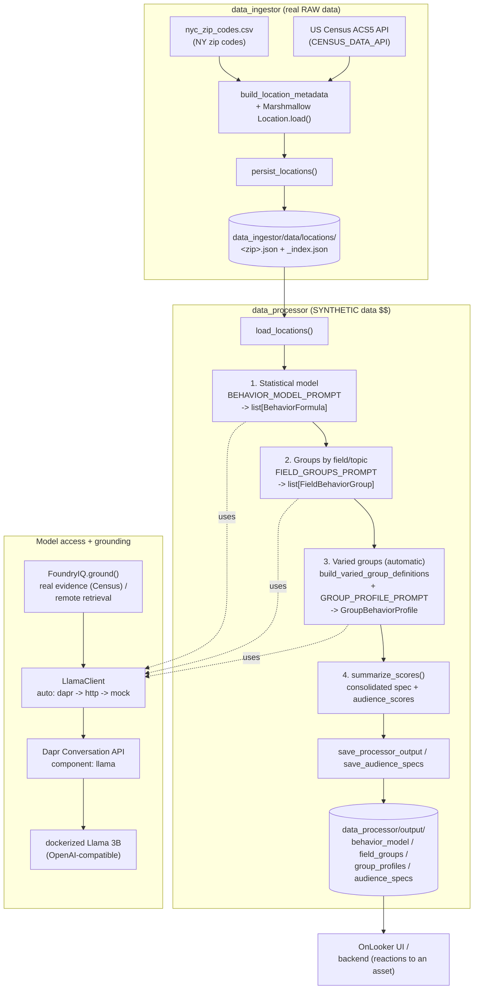
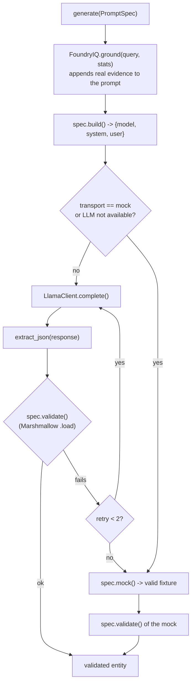
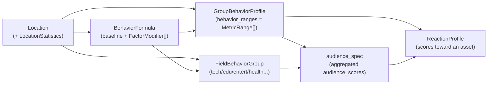

# OnLooker — Synthetic audience pipeline workflow

End-to-end flow: from real Census data (NY) to synthetic audience groups with
scores, anchored in real evidence (Foundry IQ) and generated by a dockerized
Llama 3B via Dapr.

## 1. Overview



## 2. Validated generation (a PromptSpec)

Each generation step goes through the same cycle, with strict validation against
the schema and degradation to mock if there is no model.



## 3. Data model (key entities)



## How to run

```bash
# 1) Real raw data -> persisted by zip_code
python -m data_ingestor.main                 # requires CENSUS_DATA_API in .env

# 2) Synthetic audience (auto: dapr -> http -> mock)
python -m data_processor

# "Llama via Dapr agents" path
dapr run --app-id data-processor \
         --resources-path data_processor/components \
         -- python -m data_processor --transport dapr

# Offline demo (no model)
python -m data_processor --transport mock
```
